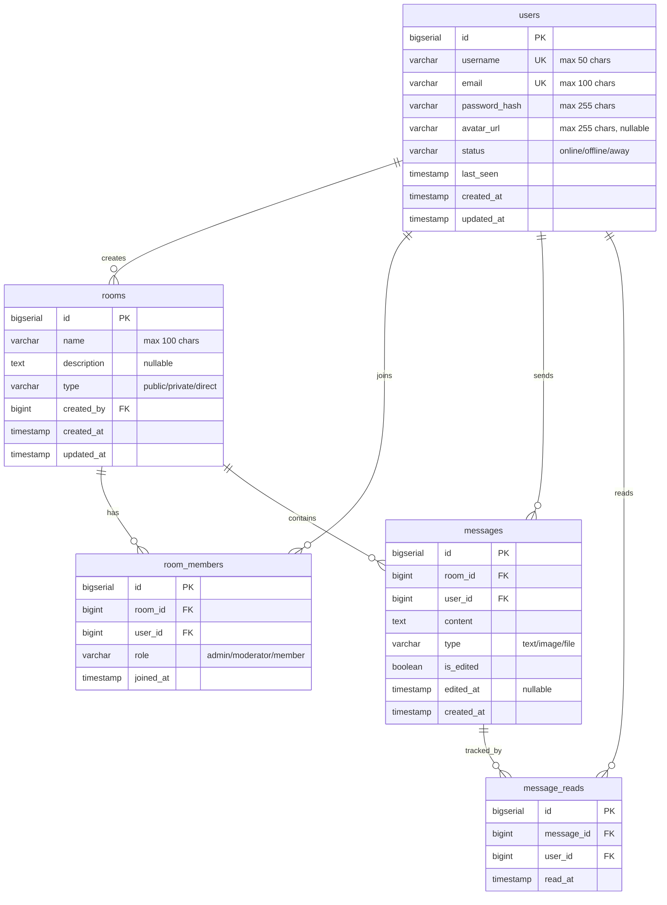

# Database Schema Diagram

## Entity Relationship Diagram

## Table Relationships

### users → rooms
- **Type**: One-to-Many
- **Relationship**: A user can create multiple rooms
- **Foreign Key**: `rooms.created_by` references `users.id`

### users ↔ rooms (via room_members)
- **Type**: Many-to-Many
- **Relationship**: Users can join multiple rooms, rooms can have multiple members
- **Junction Table**: `room_members`
- **Foreign Keys**:
  - `room_members.user_id` references `users.id`
  - `room_members.room_id` references `rooms.id`
- **Additional Fields**: `role` (admin/moderator/member), `joined_at`
- **Constraint**: Unique constraint on `(room_id, user_id)` to prevent duplicate memberships

### users → messages
- **Type**: One-to-Many
- **Relationship**: A user can send multiple messages
- **Foreign Key**: `messages.user_id` references `users.id`

### rooms → messages
- **Type**: One-to-Many
- **Relationship**: A room contains multiple messages
- **Foreign Key**: `messages.room_id` references `rooms.id`
- **Cascade**: Messages are deleted when room is deleted

### messages ↔ users (via message_reads)
- **Type**: Many-to-Many
- **Relationship**: Messages can be read by multiple users, users can read multiple messages
- **Junction Table**: `message_reads`
- **Foreign Keys**:
  - `message_reads.message_id` references `messages.id`
  - `message_reads.user_id` references `users.id`
- **Additional Fields**: `read_at` timestamp
- **Constraint**: Unique constraint on `(message_id, user_id)` to prevent duplicate read receipts
- **Cascade**: Read receipts deleted when message is deleted

## Indexes

For optimal query performance:

- `idx_messages_room_id` - Fast lookup of messages by room
- `idx_messages_created_at` - Chronological message ordering
- `idx_room_members_user_id` - Find all rooms for a user
- `idx_room_members_room_id` - Find all members in a room
- `idx_message_reads_user_id` - Track what a user has read

## Cascade Delete Behavior

- Delete a **room** → Deletes all `room_members`, `messages`, and `message_reads` for that room
- Delete a **user** → Deletes their `room_members` entries and `message_reads` (messages remain with user_id reference)
- Delete a **message** → Deletes all `message_reads` for that message
